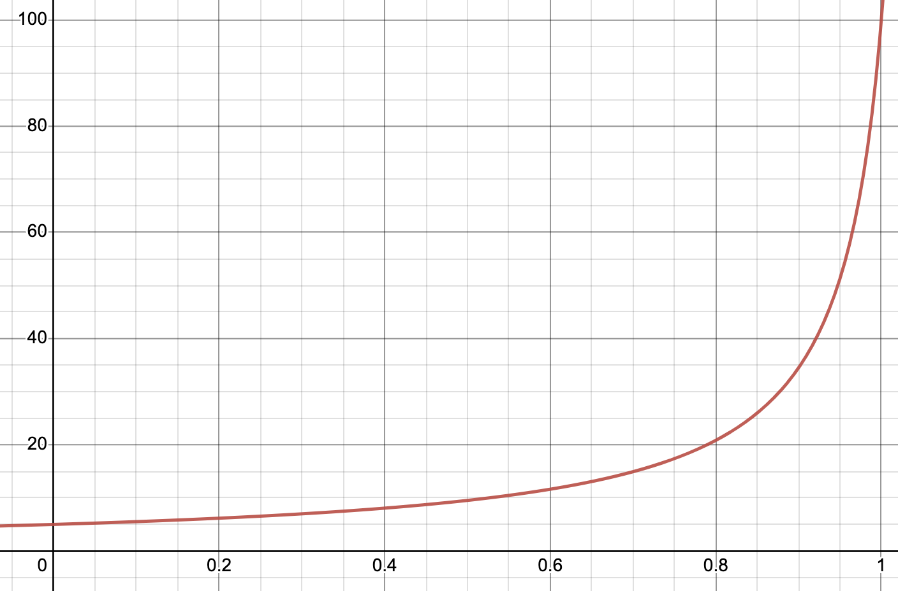
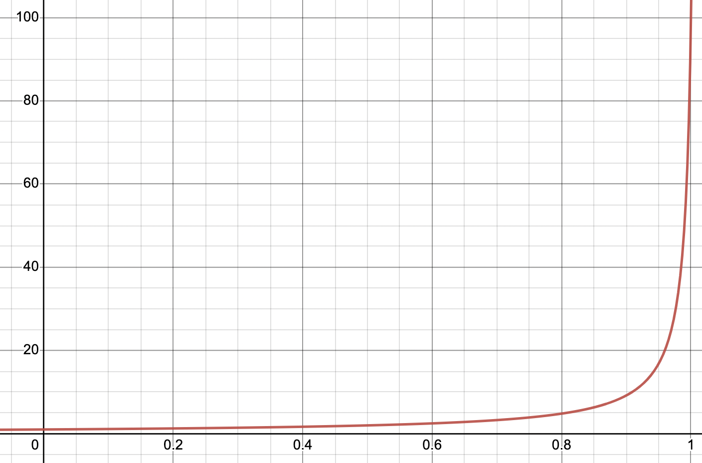
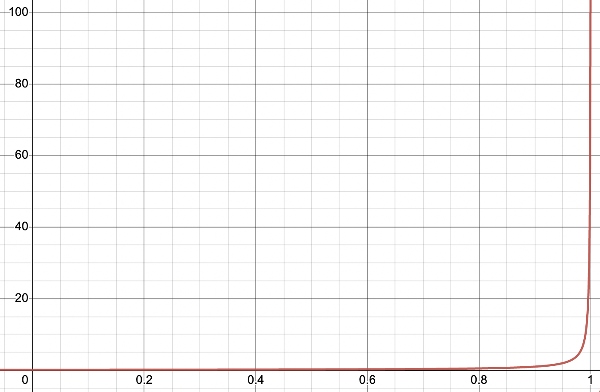

## Topic

A look at why switching to reverse z for a perspective projection matrix has such a dramatic effect.

## Motivation

Reverse z is something I wanted to implement for the longest time. I wanted to understand what was required and observe first hand the improved results of adopting it (in a nutshell, less, if any, z-fighting). In doing so I came to fully appreciate the quirkiness of the floating-point format (IEEE 754) and thought the journey of discovery was worth sharing.

The article is in two parts. The first is a quick look at one way to create a reverse Z projection matrix (without making lots of new variations) and how to use them in a simple graphics scene. The second will look at why the difference between regular z and reverse z is so dramatic and will delve into some insights I hadn’t fully grasped when it comes to floating point numbers.

## Reverse Z Perspective Projection

### How

The classic OpenGL perspective projection matrix looks something similar to this (there are many slight variations).

```c++
mat4 perspective_opengl_rh(
  const float fovy, const float aspect, const float n, const float f)
{
  const float e = 1.0f / std::tan(fovy * 0.5f);
  return {e / aspect, 0.0f,  0.0f,                    0.0f,
          0.0f,       e,     0.0f,                    0.0f,
          0.0f,       0.0f, (f + n) / (n - f),       -1.0f,
          0.0f,       0.0f, (2.0f * f * n) / (n - f), 0.0f};
}
```

The matrix above produces a right handed coordinate system (by convention it seems OpenGL tutorials/examples use a right handed coordinate system, but this could just as easily be left handed if we update the third row to be `0.0f, 0.0f, (f + n) / (f - n), 1.0f` instead) with the resulting depth values mapped from -1 to +1.

The classic DirectX perspective projection matrix looks like this (again with many slight variations).

```c++
mat4 perspective_direct3d_lh(
  const float fovy, const float aspect, const float n, const float f)
{
  const float e = 1.0f / std::tan(fovy * 0.5f);
  return {e / aspect, 0.0f,  0.0f,             0.0f,
          0.0f,       e,     0.0f,             0.0f,
          0.0f,       0.0f,  f / (f - n),      1.0f,
          0.0f,       0.0f, (f * n) / (n - f), 0.0f};
}
```

The matrix above produces a left handed coordinate system (though again we could just as easily use right handed, the only change would be to the third row becoming `0.0f, 0.0f, f / (n - f), -1.0f`), with the resulting depth values mapped from 0 to 1.

To save having to create ‘reverse’ versions of these functions or do things like swap the `near` and `far` parameters when calling the function, we can create a new matrix that will produce a reverse Z friendly matrix for us.

> Note: The `mat_mul` function referenced here multiplies its arguments left to right (the left matrix is always applied first).

```c++
mat4 reverse_z(const mat4& perspective_projection)
{
  constexpr mat4 reverse_z {1.0f, 0.0f,  0.0f, 0.0f,
                            0.0f, 1.0f,  0.0f, 0.0f,
                            0.0f, 0.0f, -1.0f, 0.0f,
                            0.0f, 0.0f,  1.0f, 1.0f};
  return mat_mul(perspective_projection, reverse_z);
}
```

In the case of the OpenGL matrix, because we first want to have the depth range mapped from 0 to 1 instead of -1 to 1, we can use a similar approach for that before applying the reverse z matrix.

```c++
// map from -1 to 1 to 0 to 1
mat4 normalize_unit_range(const mat4& perspective_projection)
{
  constexpr mat4 normalize_range {1.0f, 0.0f, 0.0f, 0.0f,
                                  0.0f, 1.0f, 0.0f, 0.0f,
                                  0.0f, 0.0f, 0.5f, 0.0f,
                                  0.0f, 0.0f, 0.5f, 1.0f};
  return mat_mul(perspective_projection, normalize_range);
}
```

To compose these together we can then do this...

```c++
const mat4 perspective_projection = perspective_opengl_rh(
  radians(60.0f), float(width) / float(height), near, far);
const mat4 reverse_z_perspective_projection =
  reverse_z(normalize_unit_range(perspective_projection));
```

We create a standard perspective matrix and update the depth mapping to be from -1 to 1 to 0 to 1 (all the matrix is doing is multiplying by 0.5 then adding 0.5 to achieve this). It then flips the z/depth value to go from 1 to 0 instead of 0 to 1. Using this approach we can avoid a combinatorial explosion of perspective projection matrices for the various graphics APIs and conventions (note: Metal is identical to DirectX, and Vulkan can be created by taking the OpenGL projection matrix, remapping the depth from 0 to 1 as before, and then additionally flipping the Y axis. This is required because in Vulkan the Y axis in clip space points down).

```c++
mat4 perspective_vulkan_rh(
const float fovy, const float aspect, const float n, const float f)
{
  constexpr mat4 vulkan_clip {1.0f,  0.0f, 0.0f, 0.0f,
                              0.0f, -1.0f, 0.0f, 0.0f,
                              0.0f,  0.0f, 0.5f, 0.0f,
                              0.0f,  0.0f, 0.5f, 1.0f};
  return mat_mul(perspective_opengl_rh(fovy, aspect, n, f), vulkan_clip);
}
```

> Note: The above approach is highly opinionated and there are multiple other ways to achieve the same effect. For example flipping y in the shader or setting a negative height for the viewport in Vulkan works just as well. With reverse z it’s possible to just flip the order of the near and far arguments when using the regular projection matrix. For whatever reason I prefer the above approach but please do what’s best for you and be aware of these other approaches out in the wild.

Once that’s done, in whatever graphics API you’re using you then need to ensure three additional things (four in OpenGL)

1. Clear depth to 0 (not 1 as usual).
2. Set depth test to _greater_ (not _less_ as usual).
3. Ensure you’re using a floating point depth buffer (e.g. `GL_DEPTH_COMPONENT32F`, `DXGI_FORMAT_D32_FLOAT_S8X24_UINT`, `MTLPixelFormat.depth32Float` etc.)
4. (in OpenGL) Make sure `glClipControl(GL_LOWER_LEFT, GL_ZERO_TO_ONE);` is set so OpenGL knows the depth range will be 0 to 1 and not -1 to 1.

> Note: Please see links at the end of this article for a simple project demonstrating the effect and how to set things up.

### Why

To understand _why_ reverse z is so much better than using regular z, we need to take a closer look at how floating point numbers are represented. For a 32 bit float we have the sign bit (1 bit), the exponent (8 bits) and the mantissa (23 bits). With the depth buffer, we ideally want to get as much precision as possible, and it turns out there is a truly _insane_ amount of precision near 0 with floating point numbers. I hadn’t fully appreciated the extent of this until recently and when I saw the numbers (no pun intended), it blew my mind.

If we take two positive floating point numbers (or 0) and convert them to integers (using C++20’s `bitcast` or `memcpy` if we don’t have access to that) and subtract one from the other, we can see how many distinct numbers exist between those two values. When we do this with numbers near 0 we get some interesting results.

```c++
int representableValues(float from, float to)
{
  uint32_t fromi;
  memcpy(fromi, from, sizeof(float));
  uint32_t toi
  memcpy(toi, to, sizeof(float));
  return toi - fromi;
}

printf("0.0f - 0.5f: %d\n", representableValues(0.0f, 0.5f));
printf("0.5f - 1.0f: %d\n", representableValues(0.5f, 1.0f));

// output
0.0f - 0.5f: 1056964608
0.5f - 1.0f: 8388608
0.0f - 1.0f: 1065353216
```

If we do the math, we can see that out of the total range between 0.0 and 1.0, only approximately **0.79%** of all representable values are between 0.5 and 1.0, with a staggering **99.21%** between 0.0 and 0.5. I always knew there was more precision near 0, but I don’t think I’d fully appreciated by quite how much.

> Aside: To check `representableValues` for consistency, we can use the handy `std::nextafter`, which returns the next representable value of `from` in the direction of `to`. A slow but accurate check can be written like so:

```c++
int count = 0;
float from = 0.0f, to = 1.0f;
while (from < to) {
  from = std::nextafter(from, to);
  count++;
}
printf("0.0f - 1.0f: %d\n", count);
```

The number **8388608** is also important. If we take the next power of 2 (and so on), and subtract one from the other (in this case 2.0 and 1.0), what number do you expect we’ll get...

```c++
printf("1.0f - 2.0f: %d\n", representableValues(1.0f, 2.0f));
printf("2.0f - 4.0f: %d\n", representableValues(2.0f, 4.0f));
printf("4.0f - 8.0f: %d\n", representableValues(4.0f, 8.0f));
....

// output
1.0f - 2.0f: 8388608
2.0f - 4.0f: 8388608
4.0f - 8.0f: 8388608
...
```

> Technically we should be using `representableValues(1.0f, std::nextafter(2.0f, 0.0f));` to give us a half-open range (usually denoted as `[<from>, <to>)`) where we don’t include the final value. We can alternatively just subtract 1 ourselves from 8388608.

What else do you notice about 8388608? Well it turns out this is just 2^23, which is the number of bits in the mantissa of the floating point representation! The exponent (8 bits) only represents powers of two, with the bits in the mantissa being used to make up the difference between the two. The issue is as the powers of two increase, we still only have 8388608 - 1 values to use, and as the numbers increase, the jumps between them are going to increase, leading to a loss of precision.

With the exponent, when the upper most bit isn’t set, all combinations refer to negative powers of 2. With all but the upper most bit set we get the value 1. Any other combination (with the upper most bit set) will be positive powers of 2. The exponent ranges from -126 to 127. For each choice of your exponent, you have a fixed set of bits in your mantissa to represent the numbers in that range. The important thing to notice is how the majority of those valid exponents cover the range from 0 to 1.

```c++
// exponent bits examples
[0][1][1][1][1][1][1][1] == 2^0 // 1
[1][0][0][0][0][0][0][0] == 2^1 // 2
[0][1][0][1][0][0][1][1] == 2^-44 // 5.68434188608e-14
```

If we take those 7 bits we know are available (excluding the uppermost bit of the exponent), and combine them with the 28 bits in the mantissa, we get 2^30 values (1073741824) that can be represented between 0.0 and 2.0. If we then subtract 8388608 from it, lo and behold we get 1065353216, which you should recognize from before as the number of values that can be represented between 0.0 and 1.0. If we subtract 8388608 again we get the number of values between 0.0 and 0.5. As we know how many numbers are left over this shows just how much precision there is to utilize between 0.0 and 0.5.

To help gain a better intuition for floating point numbers and how they’re represented, check out this fantastic online tool that you can use to interactively set the various bits in a floating point number or see what a given number corresponds to. It’s illuminating - [https://www.h-schmidt.net/FloatConverter/IEEE754.html](https://www.h-schmidt.net/FloatConverter/IEEE754.html).

### What were we talking about again?

Oh yes reverse z! After our brief diversion into floating point numbers, lets return again to reverse z and why this change can lead to such significant improvements. Let’s take a look at the formula for transforming our view space depth (z) value into clip space and then normalized device coordinates (NDC). If we return to the projection matrix we looked at earlier (the `perspective_direct3d_lh` one) we can multiply out the z part which becomes...


> These terms should look familiar from `perspective_direct3d_lh` - (`f / (f - n)` and `(f * n) / (n - f)` from m22 and m23 (row, col ordering).

We then do the perspective divide (separate to the matrix multiplication above).


And this will tell us our normalized depth value in NDC. If we choose a generous near clip plane of 1.0 and far clip plane of 100.0, and give an input value of say 5.0 to this equation we get an interesting result. The depth value is 0.808! That means even when we’re using regular z, and we have a value near the clip plane, we already have completely discarded an insane amount of precision because all those values near 0 already can’t be used. If we put in more representative numbers things get even worse. With a near clip plane of 0.01 and a far clip plane of 1000.0, using a view space depth value of 5.0 gives 0.998 😱. That means we only have 33554 unique values left to represent normalized depth between 5.0 and 1000 which isn’t great.

> The reason for this bunching up of values near 1.0 is down to the non linear perspective divide. The perspective projection matrix will take the current depth (also known as z) value and transform it so dividing it by the current depth will give a value of 0.0 at the near clip plane and 1.0 at the far clip plane (and values between 0.0 and 1.0 for values within that range). As the depth value increases, the non linear relationship between z and 1/z will mean for small values of z the curve will grow slowly but as z increases 1/z grows exponentially, quickly running away from 0 where all the precision is. Have a play around with [this graph](https://www.desmos.com/calculator/lmjf1bkyeo) to see the effects on the curve of changing the near and far plane. Notice how changing the near plane has a more pronounced effect. There are three snapshots below to illustrate a perspective transform with the far clip plane at 100 and near clip plane at 5.0, 1.0 and 0.1 respectively.

        

If however, we flip to using reverse z, things get a lot better. The flipped equation looks like this...


Which by the way is equivalent to...


Now for the near clip plane at 1.0 and far clip plane at 100.0 case, with an input value of 5.0, we get approximately 0.192 for the depth value. If we set the near clip plane to 0.01 and the far clip plane to 1000, a view space depth value of 5.0 becomes approximately 0.00199. The amazing thing though is in this case we have 990014121 possible unique depth values, an improvement of 29500x over regular z. Reversing z has the effect of smoothing the precision throughout the range (we leverage the fact so much precision sits between 0.0 and 0.5 by ensuring more values end up there). Without reverse z, the precision is front-loaded to the near clip plane where we don’t need as much precision.

The incredible thing about this is we gain all this extra precision and improved fidelity at no cost in performance or memory, which usually never happens in computer science or software engineering (_There are no solutions, there are only tradeoffs -_ **_Thomas Sowell_**_)._ Except it seems, when it comes to reverse z!

## Further Reading

This post was inspired by a series of excellent articles on the web covering reverse z from a number of different angles. Here’s a short list of some of the best ones if you’d like to learn more.

* [Reverse Z Cheatsheet](https://iolite-engine.com/blog_posts/reverse_z_cheatsheet)
* [Depth Precision Visualized](https://www.reedbeta.com/blog/depth-precision-visualized/)
* [Reverse Z in OpenGL](https://nlguillemot.wordpress.com/2016/12/07/reversed-z-in-opengl/)

To visualize this in action please find below a little test scene created in OpenGL to show off the effect.

* [opengl-sdl](https://github.com/pr0g/opengl-sdl)

There’s also a Metal version below though it doesn’t yet have all the features in the OpenGL demo above

* [metal-sdl](https://github.com/pr0g/metal-sdl)

To get a feel for these calculations, checkout these little interactive Desmos links (not all of them plot something but they’re useful to play around with by changing the near and far clipping planes and input depth values to see what the outputs are).

* [View space depth to NDC perspective conversion (clip + perspective divide)](https://www.desmos.com/calculator/sdax08d2ch)
* [View space depth to NDC orthographic conversion (clip)](https://www.desmos.com/calculator/lowctyx42o)
* [Plot of z and reverse z graphs](https://www.desmos.com/calculator/tuv7vpmczg)
* [NDC to view space depth conversion (inverse of clip + perspective divide)](https://www.desmos.com/calculator/f64zefjcsi)
* [View space depth to NDC perspective conversion (different scales)](https://www.desmos.com/calculator/8iqggybblq)

And finally the previously mentioned floating point calculator (can’t rate this highly enough!)

* [FloatConverter - IEEE754](https://www.h-schmidt.net/FloatConverter/IEEE754.html)

## Bonus Section

### Derivation of the equations for calculating the perspective projection applied to z


